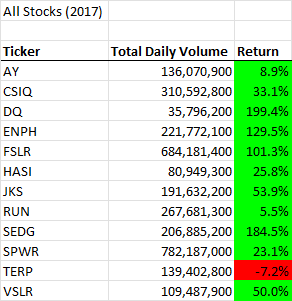
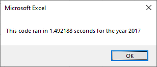
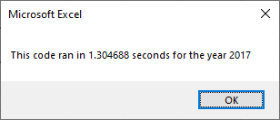
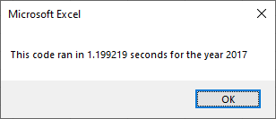
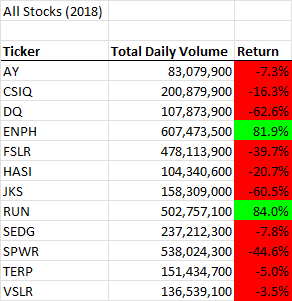
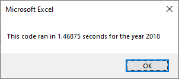
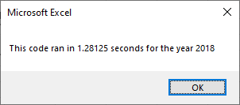

# Analysis of Stock Performance by Ticker

## 1 Overview of Project

This project was the second challenge in the Carleton University Business Analytics and Data Visualization Boot Camp.  Module 2 of the first Unit of the boot camp was intended to through th euse of VBA, learn the fundamental building blocks of programming languages. These skills included creating VBA macros, triggering pop-ups and inputs, reading and changing cell values, and format cells.  The project help us develop our skills in using nested loops and conditionals to direct logic flow.  Writing pseudo code was a very helpful skill to develop as the VBA scripts were detailed to complete the project objectives.

### 1.1 Purpose

<!-- Overview of Project: Explain the purpose of this analysis. -->
 
The purpose of the specific project within this module was to assist a client, Steve.  He has been looking into and investment his parents made in an green engergy stock, DAQO New Engergy Corp(DQ).  After looking at DQ, Steve asked us to extend the alaysis to a list of green engergy stocks.  Concerned about how slow the program will run if he tries to analyze a larger number of stock.  We were provided with pseudo code for a posisble refactoring of the original code and saked to analysis its perfromance.  Always wanting to strive for perfection, we will also research further code improvments.

### 1.2 Approach and Challenges
 
The analysis followed the general process looping through the rows of the stock transactions to find the first tranaction in a given year, for a given ticker and recording the years opening price.  The same process was followed to find the last transaction for the year's closing price. This was done for Steve earlier for only ticker DQ.  The DQAnalysis VBScript in the spreadsheet has been modified to provide Steve with a consolidated summary of DQ's rate of return.  Below is the code that allows us to analyze one sheet after another.  This was included in the workbook as a small demonstration for Steve of what could be done if he were to further engage my services.

    Dim DataYear(1) As String
    
    DataYear(0) = "2017"
    DataYear(1) = "2018"
    
    'Run analysis for every year of data
    For K = 0 To 1
                    
        Worksheets(DataYear(K)).Activate
  
Steve wanted to see all the tickers in each year so another VBScript was created AllStocksAnalysis.  This version of the VBScript was somewhat inefficent and clearly anoying because it refreshs the All Stocks Analysis worksheet as in loops though every ticker causing the screen to flicker like a strobe light.  You can see this in the code below, where j is the index for rows and i is the ticker index.

       Next j
       '6) Output data for current ticker
       Worksheets("All Stocks Analysis").Activate
       Cells(4 + i, 1).Value = ticker
       Cells(4 + i, 2).Value = totalVolume
       Cells(4 + i, 3).Value = endingPrice / startingPrice - 1

   Next i

The refactor code, in VBScript AllStocksAnalysisRefactored, resolves this inefficency by moving the writing of these values to outside of the main row by row stock analysis loop as follows.

    For i = 0 To 11
        
        Worksheets("All Stocks Analysis").Activate
        Cells(i + 4, 1) = tickers(i)
        Cells(i + 4, 2) = tickerVolumes(i)
        Cells(i + 4, 3) = tickerEndingPrices(i) / tickerStartingPrices(i) - 1
        
    Next i  

    In researching the possible causes of slow macro enabled workbooks I came across a fabulous resource that I added to another VBScript called EvenFaster.  I noticed that this Original code was constantly writing to the sheet so I found this code at https://www.dummies.com/software/microsoft-office/excel/10-ways-to-speed-up-your-macros/

    It staes that Automatic Calculations and Screen Updating can be turn off to reduce into interaction with the spreadsheet until they are needed.  Here is the code:

    Application.Calculation = xlCalculationManual
    Application.ScreenUpdating = False

    At the end of the subroutine you need to turn them on to complete the spreadsheet work.  Here is the code for that:

    Application.Calculation = xlCalculationAutomatic
    Application.ScreenUpdating = True

    It makes an amzing difference, both in time and visual program performance.
    

## 2 Analysis and Observations
<!-- Results: Using images and examples of your code, compare the stock performance between 2017 and 2018, as well as the execution times of the original script and the refactored script. -->

### 2.1 Analysis of 2017 Stocks
  
The analysis of the database included a significant number of projects in the theatre category and most of those were from the subcategory plays.  The campaign for the play Fever that was launched in June may have been slightly late.  In the graphs x.x and x.y below you can see that May appears to be the best time of year to have a successful campaign.  This is particularly true when you analyse the success and failure ratio - the decline from May to the end of the year is significant.  You will also notice that while the success rises from January to May it is not as steep of a rise and then you find that in May and June the largest numbers of campaigns are launched.  I would conclude the following:
- When you launch a campaign too early in the year it is possible that investors may be inclined to hold off to see what other opportunities may present themselves
- If you wait too late to launch, then you are likely to find that many investors have already committed their funds to another project  

  
**Table 2.1 - 2017 Stock Analysis"**

#### VBScript Perfomance on 2017 Ticker Data

  
**Figure 2.1.1 - 2017 Stock Analysis VBScript Performance Before Refactoring**

  
**Figure 2.1.2 - 2017 Stock Analysis VBScript Performance After Refactoring**

  
**Figure 2.1.3 - 2017 Stock Analysis VBScript Performance After Refactoring to an Even Faster**

### 2.2 Analysis of 2018 Stocks

The analysis of the database shows that Louise's campaign, at less than $3,000 was set at a very reasonable goal level.  The only goal level that performed better was at less than a $1,000.  However, if you consider that most ranges were $4,999 you could in fact say that Louise was in the highest success range.  You could also say that while the less than $1,000 range was the most successful at raising money, it was also somewhat of an outlier in that it was likely too small a goal to achieve anything of importance.  I would argue that Louise was well positioned in terms of goals to be successful.  There are very few campaigns with goals that exceed $25,000 and in fact it is unlikely that the results above this range are of any statistical significance based on the small sample size.  The conclusions that could be drawn are:
- There is a clear trend that demonstrates that the larger the goal the less likely it is to get sufficient pledges
- The other interesting observation is that there seems to be a significant financial threshold at the $5,000 goal level where investor's interest tends to wain

  
**Table 2.2 - 2018 Stock Analysis"**

#### VBScript Perfomance on 2018 Ticker Data

  
**Figure 3.1.1 - 2018 Stock Analysis VBScript Performance Before Refactoring**

  
**Figure 3.1.2 - 2018 Stock Analysis VBScript Performance After Refactoring**

  
**Figure 3.1.3 - 2018 Stock Analysis VBScript Performance After Refactoring to an Even Faster**

**What do we know?**  
This is what we have determine based on the work that Louise has contracted us to do.
- Louise's campaign to seek investment in June was a little late in the year just missing the May peek season.  However that is typically still in a fairly successful time of the year for investor funding
- Louise's goal was reasonable in terms of what she was looking to raise as she was well below the $5,000 apparent psychological threshold
- Unfortunately, Louise fell short of her goal

**How can we help?**  
Not wanting to leave Louis without a more significant plan to improve her chances next time, I decide to have a look at the market in which she was competing.  Using a pivot table with countries as rows, I noticed that three countries were worth looking at for the theater/play category: Canada, Great Britain and the United States.  Tables 2.3.1 and 2.3.2 below yield some valuable information for Louis:
- While the United States has by far the most campaigns the overall success rate is only 62%
- In Great Britain the success rate is an impressive 77% overall with successes 3.4 times more likely than failures
- If Louise feels the logistics of a launch in Great Britain are too difficult, she might consider Canada as an option due to the favourable investment environment and the relative proximity to the US

## 3 Challenges and Difficulties Encountered

I didn't like the the stock data had to be sort before in could be analyze, so for my own intereted I created this script the gives the same rsesults no matter how messed up the rows are.  I is pretty efficent too.  I didn't include this in the project, becuase I think we can up sell Steve on some more work for large data sets.

        'I SET THIS LOOP UP SO THAT YOU DON'T CARE WHAT ORDER THE DATA IS IN IT WILL STILL WORK
        For i = rowStart To rowEnd
                    
                rowYear = Left(Cells(i, 2), 4)
                rowMonth = Mid(Cells(i, 2), 6, 2)
                rowDay = Right(Cells(i, 2), 2)
                
                tradedate = DateSerial(rowYear, rowMonth, rowDay)
                
                If Cells(i, 1) = "DQ" Then
                
                    totalVolume = totalVolume + Cells(i, 8)
                    totalTrades = totalTrades + 1
                    
                    If tradedate <= startingDate Then
                
                        startingDate = tradedate
                        startingPrice = Cells(i, 6)
                    
                    Else
                        endingDate = tradedate
                        endingPrice = Cells(i, 6)
                    
                End If
                End If
    
    
        Next i

<!-- Summary: In a summary statement, address the following questions.
What are the advantages or disadvantages of refactoring code?
How do these pros and cons apply to refactoring the original VBA script? --> 
As mentioned at the introduction to this report there were a few data related issues that were effectively resolved though my work.  More importantly, there is a need for better, more complete, information - that is the quest of all consultants analyzing data.  For example, if it is true that projects who set a low goal are most successful at the beginning, are they also the most likely to fail in production - we don't know because the data is not available. We also know nothing about who is funding the campaign, it would be valuable to know which investors are open to what Louis has to offer. Most projects are funded at a very low level, unfortunately there are not enough data points to reasonably zoom in on the detail of that range to look for opportunities for Louise. 
## 3 Results Summary and Recommendations
I have discussed a few observations above in the report, but the overall observations are as follows:
- Louise has a viable ask in terms of financial needs
- Louise needs to improve her timing so that she hits investors at exactly the right time
- Louise may wish to look at Great Britain or even Canada as more amenable markets for her play

I would recommend that Louise further engage my consulting services to determine if it would be feasible to launch in a geographic market other than the United States.
