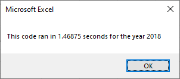

# Analysis of Stock Performance by Ticker

## 1 Overview of Project

This project was the second challenge in the Carleton University Business Analytics and Data Visualization Boot Camp.  Module 2 of the first Unit of the boot camp was intended to through th euse of VBA, learn the fundamental building blocks of programming languages. These skills included creating VBA macros, triggering pop-ups and inputs, reading and changing cell values, and format cells.  The project help us develop our skills in using nested loops and conditionals to direct logic flow.  Writing pseudo code was a very helpful skill to develop as the VBA scripts were detailed to complete the project objectives.

### 1.1 Purpose

The purpose of the specific project within this module was to assist a client, Steve.  He has been looking into and investment his parents made in an green energy stock, DAQO New Energy Corp(DQ).  After looking at DQ, Steve asked us to extend the analysis to a list of green energy stocks.  Concerned about how slow the program will run if he tries to analyze a larger number of stock.  We were provided with pseudo code for a possible refactoring of the original code and asked to analysis its performance.  Always wanting to strive for perfection, we will also research further code improvements.

### 1.2 Approach and Challenges

The analysis followed the general process looping through the rows of the stock transactions to find the first tranaction in a given year, for a given ticker and recording the years opening price.  The same process was followed to find the last transaction for the year's closing price. This was done for Steve earlier for only ticker DQ.  The DQAnalysis VBScript in the spreadsheet has been modified to provide Steve with a consolidated summary of DQ's rate of return.  Below is the code that allows us to analyze one sheet after another.  This was included in the workbook as a small demonstration for Steve of what could be done if he were to further engage my services.

    Dim DataYear(1) As String
    
    DataYear(0) = "2017"
    DataYear(1) = "2018"
    
    'Run analysis for every year of data
    For K = 0 To 1
                    
        Worksheets(DataYear(K)).Activate

The results for steve were as follows:

| DAQO (Ticker: DQ) |                    |              |
| ----------------- | ------------------ | ------------ |
|                   |                    |              |
| Year              | Total Daily Volume | Return       |
| 2017              | 35796200           | 1.994458388  |
| 2018              | 107873900          | -0.626018859 |

The results are correct but not very pretty, well they are presented here better than they are in the Excel spreadsheet - but Steve would probably like the spreadsheet to be improved (that could be future work for me).  In addition to improving the appearance, Steve wanted to see all the tickers in each ticker in a number of green stocks, so another VBScript was created AllStocksAnalysis.  This new version of the VBScript was somewhat inefficient and clearly annoying because it refreshes the All Stocks Analysis worksheet as in loops though every ticker causing the screen to flicker like a strobe light.  You can see this in the code below, where j is the index for rows and i is the ticker index.

       Next j
       '6) Output data for current ticker
       Worksheets("All Stocks Analysis").Activate
       Cells(4 + i, 1).Value = ticker
       Cells(4 + i, 2).Value = totalVolume
       Cells(4 + i, 3).Value = endingPrice / startingPrice - 1

   Next i

The refactor code, in VBScript AllStocksAnalysisRefactored, resolves this inefficency by moving the writing of these values to outside of the main row by row stock analysis loop as follows.

    For i = 0 To 11
        
        Worksheets("All Stocks Analysis").Activate
        Cells(i + 4, 1) = tickers(i)
        Cells(i + 4, 2) = tickerVolumes(i)
        Cells(i + 4, 3) = tickerEndingPrices(i) / tickerStartingPrices(i) - 1
        
    Next i  

   Creating an array for the volumes and prices was done so that this refactoring could be achieved, the results were far superior for Steve.  In further researching the possible causes of slow macro enabled workbooks I came across a fabulous resource that I added to another VBScript called EvenFaster.

   I noticed that this Original code was constantly writing to the sheet so I found this code at:  
   https://www.dummies.com/software/microsoft-office/excel/10-ways-to-speed-up-your-macros/

  It states that Automatic Calculations and Screen Updating can be turn off to reduce into interaction with the spreadsheet until they are needed.  
  Here is the code:

    Application.Calculation = xlCalculationManual
    Application.ScreenUpdating = False
    
    At the end of the subroutine you need to turn them on to complete the spreadsheet work.  Here is the code for that:
    
    Application.Calculation = xlCalculationAutomatic
    Application.ScreenUpdating = True
    
    It makes an amazing difference, both in time and visual program performance.

## 2 Analysis and Observations
### 2.1 Analysis of 2017 Stocks

Looking at table 2.1 below you can see that this was a banner year for green energy.  Here are some observations that I had for Steve's consideration of the DAQO New Energy Corp (DQ) stock in comparison to other stock in the same market:

- DQ was the highest preforming stock in 2017, significantly out performing the average stock  
- DQ was the least traded stock of comparable green energy stocks
- The highest trading stock SPWR had a postive return however it was one one of the poorest performing green stocks

  
**Table 2.1 - 2017 Stock Analysis"**

#### VBScript Performance on 2017 Ticker Data

The refactoring of the original VBScipt produced much better execution times as can be seen in the MsgBox screen shots below.  As fast as the refactoring was in you can see that it can still be improved.  Notice the progressive improvement in Figures 2.1.1, 2.1.2 and 2.1.3 for the 2017 data set.

  
**Figure 2.1.1 - 2017 Stock Analysis VBScript Performance Before Refactoring**

  
**Figure 2.1.2 - 2017 Stock Analysis VBScript Performance After Refactoring**

  
**Figure 2.1.3 - 2017 Stock Analysis VBScript Performance After Refactoring to an Even Faster**

### 2.2 Analysis of 2018 Stocks

Looking at table 2.2 below you can see that, in stark contrast to 2017, 2018 was a very poor year for green energy.  Here are some observations I had for Steve's considerations of the DAQO New Energy Corp (DQ) stock in comparison to other stock in the same market:

- In 2018 DQ was now the lowest preforming stock of all the green energy stock analyzed  
- DQ trade volume was up but still well below the average trading volume for this sector
- The highest trading stock in 2017 SPWR was still trading high but the volumes had dropped significantly and they were now showing negative returns  
- Only two stocks, ENPH and RUN were showing poitive returns in a market of big lossers, their substaintial positive returns were quite stiking

  
**Table 2.2 - 2018 Stock Analysis"**

#### VBScript Performance on 2018 Ticker Data

The refactoring of the original VBScipt produced much better execusion times as can be seen in the MsgBox screen shots below.  As fast as the refactoring was in you can see that it can still be improved.  Notice the progresive improvement in Figures 3.1.1, 3.1.2 and 3.1.3 for the 2018 data set.

  
**Figure 3.1.1 - 2018 Stock Analysis VBScript Performance Before Refactoring**

  
**Figure 3.1.2 - 2018 Stock Analysis VBScript Performance After Refactoring**

  
**Figure 3.1.3 - 2018 Stock Analysis VBScript Performance After Refactoring to an Even Faster**

### 2.3 Overview of Analysis
#### What do we know?  
There realling isn't much data to work with but here is what we know:  
- What we do know is that the beginning of 2017 was a great time to invest in the green energy sector.  
- We also know that the end of 2017 / the beginning of 2018 would have been a terrible time to make the same investment. 

#### What don't we know?
Well, there is an awful lots things that we don't know.  In fact there are way more things that are unknown, but would be helpful if we knew them:
- For one we don't know how long each of these companies have been trading.  
- We also don't know when Steve's parents first made their investment - i.e. what was their original investment.
- We don't know anything at all about the market in general, was the big decline in 2018 market wide or just in this green energy sector.  

#### How can we help?  
If Steve is willing to continue to pay for our service, we can offer Steve more assistence in answering some of these unknown questions.  Without knowing more than we currently know it would not be advisable to draw any truly meaningful recommendations for Steve that would help his parents.

## 3 Challenges and Difficulties Encountered

I didn't like the the stock data had to be sort before in could be analyze, so for my own intereted I created this script the gives the same rsesults no matter how messed up the rows are.  I is pretty efficent too.  I didn't include this in the project, becuase I think we can up sell Steve on some more work for large data sets.

        'I SET THIS LOOP UP SO THAT YOU DON'T CARE WHAT ORDER THE DATA IS IN IT WILL STILL WORK
        For i = rowStart To rowEnd
                    
                rowYear = Left(Cells(i, 2), 4)
                rowMonth = Mid(Cells(i, 2), 6, 2)
                rowDay = Right(Cells(i, 2), 2)
                
                tradedate = DateSerial(rowYear, rowMonth, rowDay)
                
                If Cells(i, 1) = "DQ" Then
                
                    totalVolume = totalVolume + Cells(i, 8)
                    totalTrades = totalTrades + 1
                    
                    If tradedate <= startingDate Then
                
                        startingDate = tradedate
                        startingPrice = Cells(i, 6)
                    
                    Else
                        endingDate = tradedate
                        endingPrice = Cells(i, 6)
                    
                End If
                End If

​    
        Next i

As mentioned at the introduction to this report there were a few data related issues that were effectively resolved though my work.  More importantly, there is a need for better, more complete, information - that is the quest of all consultants analyzing data.  What has been done for Steve throughout this project has been of value for him to do a lot of future analysis.  The refactoring of code would really not been of value if this was a one time analysis for Steve and this limited set of tickers was all that were to be review.  The refactoring effort is clearly of vale as the number of data items increments and the number of time the analysis will be run.  From my perspective, as an programmer, this exercise was of great value as I learnt a lot of tricks that I will use in the future.  I did notice that the original code was not designed well to make use of arrays and instead used variables that forced writing the the spreadsheet on every iteration of the tickers.

## 3 Results Summary and Recommendations
I have discussed a few observations above in the report, but the overall observations are as follows:
- Steve has a valuable tools to help him analysis multiple stock
- Steve is now aware of the current limitations of his data set
- Steve is also aware that we can modify the code to permit unstructure dataset
- He also knows that if it exist we can easily add sheets for different years into the analysis including the ability to select tickers from a list to focus on multi-year analysis of promising investments

I would recommend that Steve further engage my consulting services to determine if it would be feasible better investment opportunities exist in the green engergy sector they may also have an interest in.
